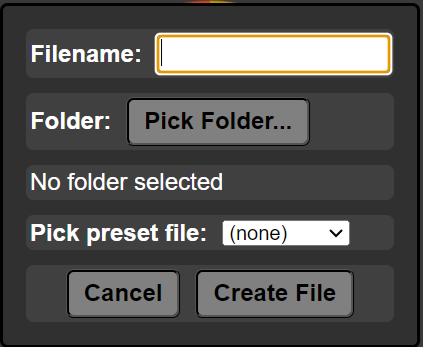

###### Go back to [index](../README.md)

---

# Create File

### Shortcut `Ctrl + N`

---

WebBox can create files using the built-in file creation function. The **"Create File"** function is capable of creating files based of presets saved on the `filePresets` folder.

    

---

Filename **must** include extension.

---

Filename and folder **are mandatory**.

---

Last modified at 12/05/25 by Ethan Mahlstedt; v1.0-rc1 
