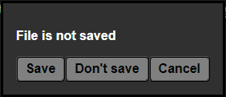

###### Go back to [index](../README.md)

---

# Close File

### Shortcut `Ctrl + Q`

---

When closing files, WebBox will prompt you to save the file if it has unsaved changes. You can choose to save the file or discard the changes.

Whenever a file has unsaved changes, the file name will be displayed in _italic_ in the tab bar. This is a visual indicator that the file has unsaved changes.

---

Last modified at 14/05/25 by Ethan Mahlstedt; v1.0-rc2 

