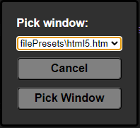

###### Go back to [index](../README.md)

---

# Viewer Windows

---

WebBox has a built-in viewer that allows you to visualize HTML files on a separate window.

The viewer is based of a Chromium browser window, which means that it is capable of using all the features of a modern browser. This includes the ability to use JavaScript and CSS files.

To open the viewer, you can use the **"Open Viewer"** function in the file menu or use the shortcut `Ctrl + W`. If you press the `Shift` Key, the viewer will open a new window off the current opened file (in the case it is a `.html` / `.htm` file), linking the viewer to the file. If not, the viewer will prompt you to pick a valid file type.

In the case you want to refresh the viewer, you can use the **"Refresh Viewer"** function in the file menu or use the shortcut `Ctrl + R`. This will refresh the current opened file in the viewer. In case the current file is not linked to any window, a prompt will show up, showing you all windows.

---

Last modified at 14/05/25 by Ethan Mahlstedt; v1.0-rc2 
